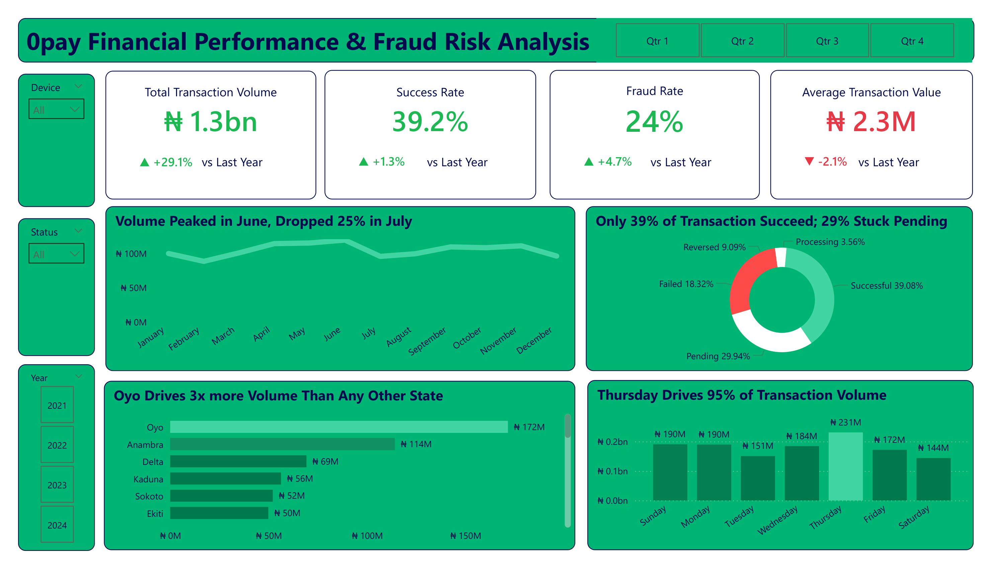
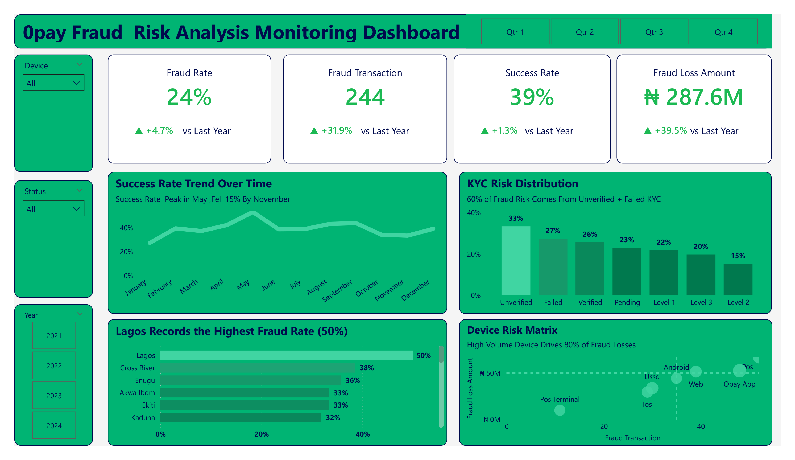

# 🔍 Opay Fraud Risk & Financial Performance Analysis

---

##  Project Overview

This project delivers a specialized, two-page financial intelligence and risk optimization dashboard built for Opay's transaction network. In high-velocity fintech environments, a raw increase in transaction scale often masks massive back-end revenue leakages and security vulnerabilities. This analysis deep-dives into a **₦1.3 Billion transaction ecosystem** to address a critical operational reality: the platform's primary exposure isn't random malicious attacks, but systemic identity verification gaps at user onboarding. 

By separating the analysis into two strategic layers, this project gives executives the exact visibility needed to fix the funnel:
*   **Page 1 (Financial Performance & Pipeline Health):** Diagnoses why 60.8% of capital volume fails to settle successfully, maps the temporal performance drop-offs between June and July, and isolates Oyo State as the core volume driver.
*   **Page 2 (Fraud Risk Intelligence):** Quantifies the **₦287.6 Million fraud footprint**, maps out the operational loss concentrations across Android and POS channels, identifies KYC compliance as the strongest observable predictor of fraud exposure within the dataset.
> **"The platform didn't have a fraud problem. It had a KYC problem."**

---

##  Dashboard Preview

### Page 1 — Financial Performance & Transaction Analysis

### Page 2 — Fraud Risk Monitoring

---

##  The Business Problem

Opay’s rapid operational scaling has triggered a double-edged operational crisis: **severe transaction friction** and **exponentially climbing fraud losses**. 

1. **Revenue Leakage from Failed Pipelines:** The transaction success rate is critically low at 39.2%, meaning roughly 60% of all customer payment attempts fail or remain trapped in "Pending" limbo. This creates massive transaction drop-offs, damages user trust, and shrinks overall platform throughput.
2. **Surging Risk Exposure:** Concurrently, fraud transaction volumes have jumped by 31.9% YoY, driving an astronomical ₦287.6M in direct fraud losses. Without isolating the core systematic vulnerabilities—whether geographic, device-specific, or identity-based—the company faces severe financial leakages and impending regulatory non-compliance.

This dashboard was developed to isolate the root causes of transaction friction, map specific fraud vectors, and deliver data-driven intervention pathways.

---

## 🧹 Data Preparation & Modeling

- Cleaned and standardized 10,500+ transaction records using SQL and Power Query.
- Removed inconsistencies across transaction statuses, risk levels, KYC categories, and device types.
- Built a star-schema data model for efficient reporting.
- Created DAX measures for Fraud Rate, Success Rate, Fraud Loss Amount, and Average Transaction Value.
- Developed interactive filters for state, device, KYC level, and transaction status analysis.

---

##  Key Findings

| Metric | Value | YoY Change |
|---|---|---|
| Total Transaction Volume | ₦1.3 Billion | ▲ +29.1% |
| Fraud Rate | 24% | ▲ +4.7% |
| Fraud Loss Amount | ₦287.6 Million | ▲ +39.5% |
| Transaction Success Rate | 39.2% | ▲ +1.3% |
| Average Transaction Value | ₦2.3 Million | ▼ -2.1% |
| Fraud Transactions | 244 | ▲ +31.9% |

---

##  Critical Insights

### 1.  Transaction Health Crisis
- Only **39% of transactions succeed** — 4 in every 10 payments
- **29% stuck in Pending**, 18% Failed, 9% Reversed
- Volume peaked in **June then dropped 25% in July**

### 2. KYC is the Fraud Firewall
- **60% of all fraud** originates from Unverified + Failed KYC users
- Unverified users alone account for **33% of fraud risk**
- Enforcing KYC at onboarding would cut fraud by more than half

### 3.  State-Level Fraud Hotspots
- **Lagos leads at 50% fraud rate** — nearly double the next state
- Cross River (38%), Enugu (36%), Akwa Ibom & Ekiti (33%) follow
- Geographically targeted fraud prevention is critical

### 4.  Device Risk Matrix
- **Android + POS devices drive 80% of fraud losses**
- High transaction volume devices cluster above the ₦50M fraud loss threshold
- Device-level risk scoring would immediately reduce exposure

### 5.  Temporal Risk Pattern
- **Thursday drives peak transaction volume (₦231M)**
- Peak volume days = peak fraud exposure windows
- Real-time monitoring must intensify on Thursdays

### 6.  Regional Volume Leaders
- **Oyo drives 3x more volume** than any other state (₦172M)
- Anambra (₦114M) and Delta (₦69M) follow
- High-volume states need dedicated fraud response teams

---

##  Strategic Recommendations

1. **Optimize Payment Funnel Mechanics:** Immediately audit payment gateway dependencies and webhook latencies to resolve the 29.9% "Pending" transaction bottleneck. Converting just 15% of these pending states into successful settlements will unlock billions in transaction liquidity.
2. **Enforce Frictionless, Hard KYC Checkpoints:** Since 60% of fraud occurs through Unverified and Failed KYC tiers, make Tier-1 verification (NIN/BVN linkage and automated selfie-matching) mandatory *before* allowing outgoing funds transfer. 
3. **Geo-Targeted Velocity Rules:** Deploy localized transaction monitoring and multi-factor authentication (MFA) triggers for high-risk locations. Transactions initiated from Lagos and Cross River should have tighter velocity limits during peak anomalies.
4. **Channel-Specific Risk Engine Scoring:** Implement specialized risk-scoring protocols for Android and POS applications. Flag and block transactions coming from rooted Android devices, emulators, or unverified POS terminal software instances.
5. **Dynamic Resource Allocation:** Scale up real-time risk-monitoring infrastructure, customer success engineers, and fraud analysts specifically on **Thursdays** to handle the surge in transaction volumes and prevent high-exposure security breaches.

---
##  Potential Business Impact

If implemented, the recommendations could help:

- Reduce fraud exposure by targeting high-risk KYC segments.
- Improve transaction success rates through payment funnel optimization.
- Strengthen compliance with regulatory KYC requirements.
- Enable proactive fraud monitoring across high-risk states and devices.
- Increase customer trust through more reliable transaction processing.
---

##  Key Lessons Learned

- Fraud analysis is most effective when operational and customer identity data are analyzed together.
- KYC compliance can be a stronger predictor of fraud exposure than transaction volume alone.
- Dashboard performance improves significantly when supported by a well-structured star schema.
- Business stakeholders respond better to actionable insights than isolated KPIs.

---
##  Tools & Technologies

- **Power BI Desktop** — Dashboard design & visualization
- **DAX (Data Analysis Expressions)** — Custom measures & KPIs
- **Data Modeling** — Relationships, calculated columns, filters
- **Power Query** — Data transformation & preparation
- **SQL** - Data cleaning 

---

##  Repository Structure

├── data/
│   └── opay_transaction_data.csv       # Raw transactional dataset (anonymized)
├── dashboard/
│   └── opay_performance_fraud.pbix    # Main Power BI dashboard file
├── screenshots/
└── README.md                               # Project documentation & insights

---
## Author

**Omobolaji Kehinde Zachariah**

Data Analyst | Business Intelligence Analyst | Power BI Developer

Passionate about transforming raw data into actionable business insights through analytics, visualization, and storytelling.

 **Email:** Komobolaji20@gmail.com

**LinkedIn:** https://www.linkedin.com/in/omobolaji-kehinde-a53912402

 **Portfolio:** https://komobolaji20-droid.github.io/
